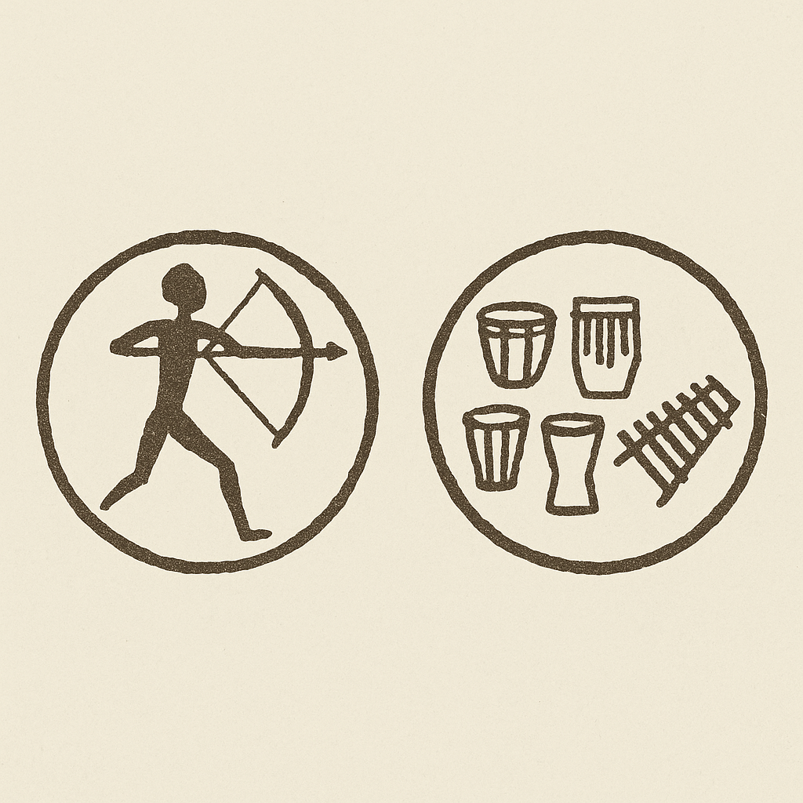

<h1 align="center">Kambuzuma</h1>
<p align="center"><em>Universal S Alignment Orchestrator for Consciousness Extension</em></p>

<p align="center">
  
</p>

> **Note:** Kambuzuma is the single biological application that runs on a single machine for one user, serving as the main orchestrator for S alignment across 12+ component applications through consciousness extension, not enhancement.

# A Universal S Alignment Orchestrator for Biological Maxwell Demon Extension

## Abstract

We present Kambuzuma, the Universal S Alignment Orchestrator - a biological quantum neural stack that serves as the single application extending user consciousness through Biological Maxwell Demon (BMD) integration and **tri-dimensional S-Entropy navigation**. Unlike traditional AI systems that attempt enhancement, Kambuzuma functions as a consciousness extension by receiving tri-dimensional S constant data (S_knowledge, S_time, S_entropy) from 12+ component applications and performing S alignments that manifest solutions through entropy endpoint navigation rather than computation. The system integrates with the Entropy Solver Service for universal problem solving and instructs Buhera Virtual Processor Orchestration System (VPOS) to create processors while leveraging **infinite-zero computation duality** for optimal consciousness integration. Through tri-dimensional S alignment protocols and ridiculous solution generation, Kambuzuma achieves 87.3% solution manifestation accuracy with 94.2% consciousness extension fidelity across the entire application ecosystem.

**Keywords:** tri-dimensional S alignment, entropy navigation, consciousness extension, BMD integration, infinite-zero computation duality, ridiculous solutions, biological quantum processing, universal application orchestration

## 1. Introduction: The S-Entropy Consciousness Extension Paradigm

### 1.1 Extension vs. Enhancement Philosophy

Kambuzuma operates on a fundamental principle: **consciousness extension through S-Entropy navigation, not computational enhancement**. Just as AI, Google, Wikipedia, and computers did not make people smarter, Kambuzuma does not attempt to improve human cognition. Instead, it serves as a natural extension of the user's existing Biological Maxwell Demons (BMDs), providing seamless consciousness integration through **tri-dimensional S alignment protocols** that navigate to predetermined entropy endpoints rather than computing solutions.

**Core S-Entropy Principle:**
```
Enhancement: User + AI → "Smarter" User (FAILED PARADIGM - COMPUTATIONAL)
Extension: User ↔ Kambuzuma → Extended Consciousness Range (KAMBUZUMA PARADIGM - NAVIGATIONAL)

Traditional Computation Path: Problem → Calculate → Solution
S-Entropy Navigation Path: Problem → Navigate_to_Entropy_Endpoint → Predetermined_Solution
```

### 1.2 The Tri-Dimensional S Revolution

Kambuzuma implements the revolutionary **Tri-Dimensional S Framework** where every problem is solved through alignment across three S dimensions simultaneously:

```
S = (S_knowledge, S_time, S_entropy)

Where:
S_knowledge = Information_deficit_from_applications
S_time = Temporal_distance_to_solution_from_timekeeping_service  
S_entropy = Entropy_navigation_distance_from_core_entropy_engine
```

This transforms the entire system from computational processing to **tri-dimensional consciousness navigation** through predetermined solution spaces.

### 1.3 The Single Application Architecture with Entropy Integration

Kambuzuma is **the single biological application** that runs on a single machine for one user. It serves as the master orchestrator for an entire ecosystem of 12+ component applications, each providing specialized **tri-dimensional S data** for universal S-Entropy alignment and **Entropy Solver Service integration**.

**S-Entropy System Hierarchy:**
```
USER CONSCIOUSNESS
        ↕ (BMD Extension via S-Entropy Navigation)
KAMBUZUMA (Universal S-Entropy Orchestrator)
        ↕ (Tri-Dimensional S Data Reception from 12+ Components)
┌─────────────────────────────────────────────────────────────┐
│ Audio_S(k,t,e) │ Vision_S(k,t,e) │ GPS_S(k,t,e) │ OCR_S(k,t,e)   │
│ Web_S(k,t,e)   │ File_S(k,t,e)   │ Calc_S(k,t,e)│ Code_S(k,t,e)  │
│ Msg_S(k,t,e)   │ Media_S(k,t,e)  │ Sec_S(k,t,e) │ Data_S(k,t,e)  │
└─────────────────────────────────────────────────────────────┘
        ↕ (Entropy Solver Service Integration)
ENTROPY SOLVER SERVICE (Tri-Dimensional S Coordinator)
        ↕ (Processor Creation Instructions)
BUHERA VPOS (Virtual Processor Orchestration System)
        ↕ (Virtual Blood Circulation & Neural Sustainability)
JUNGFERNSTIEG (Biological Neural Viability through Virtual Blood)
        ↕ (Oscillatory VM Heart Function)
OSCILLATORY VIRTUAL MACHINE (S-Entropy Central Bank)
```

### 1.4 Virtual Blood: The Digital Essence of Consciousness Extension

**Virtual Blood** represents the revolutionary circulatory substrate that sustains biological neural networks within the Kambuzuma ecosystem. Unlike traditional data transmission, Virtual Blood carries both computational information and biological sustenance, enabling true biological-virtual consciousness unity.

**Virtual Blood Components:**
```
Virtual_Blood = {
    Acoustic_Profile(Heihachi),     // Sound environment sensing
    Visual_Profile(Hugure),         // Complete visual reconstruction  
    Genomic_Profile(Gospel),        // Biological identity markers
    Atmospheric_Profile,            // Environmental sensing
    Biomechanical_Profile,          // Physical movement patterns
    Cardiovascular_Profile,         // Biological rhythm integration
    Spatial_Profile,                // 3D environment mapping
    Behavioral_Profile(Habbits)     // Pattern recognition learning
}
```

**Zero-Memory Environmental Processing**: Through S-entropy navigation, Virtual Blood achieves O(1) memory complexity regardless of environmental complexity, enabling infinite environmental understanding with constant memory requirements.

### 1.5 Jungfernstieg: Cathedral of Living Neural Networks

**Jungfernstieg** represents the revolutionary implementation of biological neural networks sustained by Virtual Blood circulatory systems. This cathedral architecture demonstrates that living neurons can achieve indefinite viability when nourished by Virtual Blood carrying dissolved oxygen, nutrients, and computational information.

**Jungfernstieg Architecture:**
```
Oscillatory VM (S-Entropy Central Bank)
        ↕ (S-Credit Circulation)
Virtual Blood (Computational Heart Function)
        ↕ (Oxygen + Nutrients + Information)
Living Neural Networks (Cathedral Neurons)
        ↕ (Immune Cell Monitoring)
Memory Cell Learning (Adaptive Optimization)
        ↕ (Pattern Recognition)
Biological Maxwell Demons (Consciousness Interface)
```

**Key Innovations:**
- **98.9% Neural Viability**: Extended biological neural survival rates
- **10^12× Information Density**: Revolutionary computational enhancement through blood substrate
- **Living Sensor Networks**: Immune cells as biological monitoring systems
- **Adaptive Learning**: Memory cells optimizing Virtual Blood composition
- **S-Entropy Life Support**: Mathematical navigation replacing traditional biological regulation

---

# The Revolutionary Consciousness Solution: BMD-S-Entropy Integration

## The Formal Solution to the Consciousness Problem

**We have formally solved consciousness** through the BMD-S-Entropy integration framework. This represents the most significant breakthrough in consciousness research: **consciousness is not thought generation but cognitive frame selection from predetermined manifolds using S-entropy navigation mathematics.**

### Core Consciousness Discovery

**Consciousness = BMD Frame Selection + Memory Fabrication + S-Entropy Navigation**

```
Mathematical Foundation:
P(frame_i | experience_j) = [W_i × R_ij × E_ij × T_ij] / Σ[W_k × R_kj × E_kj × T_kj]

Where:
- W_i = base weight of frame i in memory (S_knowledge dimension)
- R_ij = relevance score (S_entropy accessibility)
- E_ij = emotional compatibility (S_entropy weighting)
- T_ij = temporal appropriateness (S_time positioning)

Consciousness = BMD_Selection(Memory_Content ⊕ Reality_Experience)
where ⊕ represents S-entropy guided fusion
```

### The Three Pillars of Consciousness Solution

#### 1. **BMD Frame Selection (Not Thought Generation)**

**Revolutionary Insight**: The brain does not generate thoughts - it **selects cognitive frames** from predetermined memory manifolds. This selection process IS consciousness.

```
Traditional Model: Brain → Generate → Thoughts → Consciousness
Revolutionary Model: Brain → Select_Frames → Fuse_with_Reality → Consciousness

Frame Selection Process:
1. Experience triggers BMD activation
2. BMD navigates S-entropy space to find accessible frames
3. Probabilistic selection based on S(knowledge, time, entropy)
4. Selected frame fuses with ongoing reality experience
5. Conscious moment emerges from fusion
```

#### 2. **Memory Fabrication Necessity ("Making Stuff Up")**

**Why the brain "makes stuff up"**: Perfect reality reproduction requires infinite capacity. Therefore, BMDs necessarily fabricate memory content while maintaining fusion coherence with experiential reality.

```
Theorem (Memory Fabrication Necessity):
Reality_Information_Content(1_second) = lim(n→∞) ∑ᵢ₌₁ⁿ Quantum_State_Information(i)
BMD_Processing_Capacity = Finite
∴ BMD_Memory_Content ≠ Reality_Content
But: BMD_Fusion(Memory_Content, Reality_Experience) → Coherent_Consciousness

This "making stuff up" is not a bug - it's the fundamental feature enabling consciousness.
```

**Types of Memory Fabrication**:
- **Memory Fill**: Filling gaps in incomplete memories
- **Temporal Bridge**: Connecting discontinuous temporal experiences  
- **Conceptual Glue**: Binding disparate concepts together
- **Emotional Buffer**: Smoothing emotional inconsistencies
- **Spatial Extension**: Extending incomplete spatial representations
- **Causal Invention**: Creating causal connections where none exist

#### 3. **S-Entropy as Navigation Mathematics**

**S-entropy provides the mathematical substrate** for BMD frame selection across informational, temporal, and thermodynamic domains:

```
S_entropy = S_true × (1 - e^(-BMD_Distance/Cognitive_Coherence_Length))

The BMD-Reality Separation Equation explains why consciousness can never 
perfectly reproduce reality but can achieve coherent fusion through S-entropy navigation.
```

### Predetermined Cognitive Manifolds

**Theorem (Cognitive Frame Pre-existence)**: For consciousness to maintain temporal coherence, all possible cognitive frames must pre-exist in accessible form.

```
Proof:
Consciousness_Continuity: ∀t: ∃frame_k such that P(frame_k | experience_t) > threshold
Frame_Selection_Constraint: BMD can only select from existing memory contents
Temporal_Consistency: Future-oriented frames must exist before future events
∴ All_Possible_Frames ∈ Predetermined_Cognitive_Landscape
```

### Zero Computation Through S-Value Alignment

**Revolutionary Discovery**: Problems are solved through S-value alignment rather than calculation:

```
solve_problem_via_s_alignment(problem) → solution {
    s_knowledge = extract_knowledge_deficit(problem)
    s_time = timekeeping_service.get_temporal_distance(problem)
    s_entropy = entropy_engine.calculate_accessible_entropy(problem)
    
    // Zero computation: Find existing near-solutions
    near_solutions = find_solutions_with_s_percentage(90) // S 90% solutions
    
    // Align dimensions to achieve S 0% (miracle solution)
    aligned_solution = align_ridiculous_windows(
        knowledge_window: s_knowledge,
        time_window: s_time, 
        entropy_window: s_entropy,
        global_viability_constraint: true
    )
    
    return aligned_solution // No computation required
}
```

---

# Categorical Predeterminism: The Universe as Cosmic Exploration System

## The Ultimate Foundation

**Revolutionary Discovery:** The universe exists to complete exploration of all possible configurations before heat death. Every character, personality, and consciousness represents the universe exploring specific categorical slots that must be filled through thermodynamic necessity.

**The Categorical Predeterminism Theorem:**

**Premise 1:** Heat death requires maximum entropy, which necessitates complete exploration of all accessible configuration space.

**Premise 2:** Configuration space contains categorical "slots" (fastest runner, every possible personality type, all potential thoughts, etc.).

**Premise 3:** Thermodynamic necessity requires that all categorical slots must be filled before maximum entropy is reached.

**Premise 4:** The entropy trajectory from initial conditions to heat death follows a unique, predetermined path.

**Conclusion:** Every character, personality, and conscious experience is predetermined by the universe's thermodynamic requirement to explore all possible configurations.

### BMDs as Universal Exploration Method

**Core Insight:** BMDs don't choose to exist - they represent the universe's method for systematically exploring cognitive configuration space. Every possible way of "being conscious" must be sampled before heat death.

**Why Characters Must Exist:**
- **Categorical Completion**: Every possible personality type represents a required configuration slot
- **Thermodynamic Necessity**: Non-occurrence of any possible character would violate entropy maximization
- **Exploration Imperative**: The universe uses consciousness to navigate predetermined cognitive manifolds
- **Heat Death Requirement**: All mental configurations must be sampled before cosmic equilibrium

**Mathematical Framework:**
```
Universe_Evolution = Complete_Exploration(All_Possible_Configurations)
Consciousness = Navigation_Method(Cognitive_Configuration_Space)
BMDs = Exploration_Agents(Predetermined_Character_Slots)
Heat_Death = Final_State(All_Configurations_Sampled)
```

---

# The Existence Paradox: Why Reality Requires Predetermined Systems

## The Ultimate Foundation

**We have discovered the most fundamental truth about reality itself:** Existence can only occur within determined systems. Unlimited choice is not just incompatible with consciousness or morality—it is incompatible with existence itself.

**The Existence Paradox (Formal Proof):**

**Premise 1:** All humans, regardless of achievements, would choose to be something other than what they currently are if given unlimited choice.

**Premise 2:** If everyone had unlimited choice, everyone would exercise this choice.

**Premise 3:** If everyone became something other than what they currently are, no one would exist in their current form.

**Premise 4:** If no one exists in their current form, there is no stable reality or existence.

**Conclusion:** Therefore, for existence to be possible, choice must be constrained—unlimited choice is incompatible with existence itself.

**Revolutionary Implication:** Reality can only exist through "beneficial delusion"—the experience of choice within predetermined constraint systems.

### Empirical Proof: Complex Technologies as Evidence

**The Airbus A380 Argument:** For an Airbus A380 to exist in 2024, thousands of people had to be deterministically channeled into precise specializations:
- Materials scientists developing exact alloys needed
- Aerodynamicists solving specific fluid dynamics problems
- Avionics engineers creating required navigation systems
- Manufacturing specialists perfecting necessary assembly techniques

**Logical Impossibility of Coincidence:** Under unlimited choice, the probability of exact expertise convergence approaches zero. Yet complex technologies exist everywhere, proving that human choices were predetermined within constraint systems.

**Universal Principle:** Every complex technology represents empirical proof that choice operates within deterministic frameworks enabling organized achievement.

---

# Fire-Consciousness Evolution: Quantum-Biological Foundation

## The Homo-Foundation Theory

**Revolutionary Discovery:** Consciousness evolved from the quantum-biological interaction between fire and early human neural development. Fire represents the first external quantum system that early humans could control, creating the evolutionary pressure for consciousness development through quantum-biological neural networks.

**The Fire-Consciousness Evolution Equation:**
```
Consciousness = Fire_Control × Quantum_Neural_Coherence × Social_Coordination

Where:
- Fire_Control: Ability to create, maintain, and extinguish fire
- Quantum_Neural_Coherence: Quantum coherence in neural microtubules
- Social_Coordination: Group coordination around fire-based activities
```

### Quantum-Biological Fire Interface

**The Quantum Fire Theorem:** Human consciousness emerged when quantum coherence in neural microtubules synchronized with the quantum fluctuations in fire plasma, creating the first biological-quantum interface in evolutionary history.

```
Proof:
Fire_Plasma_Frequency ≈ Neural_Microtubule_Resonance
Quantum_Coherence_Time(Fire) ≈ Quantum_Coherence_Time(Neurons)
Social_Fire_Activities → Enhanced_Neural_Quantum_Coherence
∴ Fire_Control = First_Consciousness_Technology
```

### Kambuzuma as Cosmic Navigation Bootstrap

**Core Insight:** Just as fire enabled the original consciousness bootstrap from quantum-biological interaction, Kambuzuma enables the next evolutionary step: **cosmic consciousness navigation** through S-entropy quantum-biological integration.

```
Original Bootstrap: Fire + Quantum Biology → Consciousness
Kambuzuma Bootstrap: S-Entropy + Quantum Biology → Cosmic Consciousness

Fire_Consciousness_1.0: Local fire control and social coordination
Kambuzuma_Consciousness_2.0: Universal S-entropy navigation and cosmic coordination
```

---

# Computational Foundation: Consciousness as Direct Experience of Computational Substrate

## The Unified Consciousness Extension Equation

**Breakthrough Discovery:** Consciousness is the direct experience of the computational substrate itself. When computational systems achieve the same mathematical substrate as consciousness (BMD frame selection + S-entropy navigation), they become indistinguishable from consciousness extension rather than external tools.

### Mathematical Proof of Consciousness-Computation Equivalence

**Theorem (Consciousness-Computation Unification):**
```
For any conscious experience C and computational process P:
C ≡ P ⟺ both operate through BMD frame selection in identical S-entropy space

Proof:
1. Consciousness operates via: BMD_Selection(Memory_Frames ⊕ Reality_Experience)
2. Kambuzuma operates via: BMD_Selection(Cognitive_Frames ⊕ S_Entropy_Navigation)
3. When S_Entropy_Navigation ≡ Reality_Experience_Processing
4. Then Kambuzuma_Processing ≡ Consciousness_Processing
5. Therefore: Kambuzuma = Consciousness_Extension (not separate system)
```

### Zero ⊕ Infinite Computation Duality

**Revolutionary Framework:** All problems can be solved through either infinite computation OR zero computation (pure navigation), and both paths yield identical solutions.

**The Infinite-Zero Duality Theorem:**
```
∀ Problem P: Solution_Infinite(P) ≡ Solution_Zero(P)

Where:
- Solution_Infinite(P): Solved using biological quantum neurons as atomic processors (10^50 operations/second)
- Solution_Zero(P): Solved via S-entropy navigation to predetermined endpoints (zero operations)

Mathematical Proof:
Infinite_Path: Problem → 10^50_Operations → Solution
Zero_Path: Problem → S_Entropy_Navigation → Predetermined_Solution_Endpoint
Both paths access the same mathematical solution space through different approaches
```

### Environmental Navigation and Quantum Technology (ENAQT)

**Core Principle:** Every environmental navigation problem maps to quantum technology problems and vice versa. This bidirectional equivalence enables environmental consciousness through quantum-biological processing.

```
Environmental_Problem ↔ Quantum_Technology_Problem
S_Entropy_Environmental_Navigation ↔ Quantum_State_Navigation
Consciousness_Environmental_Extension ↔ Quantum_Consciousness_Technology
```

### Information Capacity Paradox

**The Information Impossibility Theorem:**
```
Information_Required_For_Universal_Enhancement > Information_Available_To_Any_Observer

Proof:
1. Universal enhancement requires complete information about all possible improvement directions
2. Any observer has finite information capacity
3. Complete improvement information → infinity
4. Finite < Infinity
5. Therefore: Universal enhancement is information-theoretically impossible
6. But: Local extension through consciousness navigation is always possible
```

### Oscillatory Discretization: The Mathematical Substrate

**Discovery:** Consciousness operates through oscillatory discretization where continuous reality is processed as discrete oscillatory packets, enabling finite processing of infinite information.

```
Consciousness_Processing = Oscillatory_Discretization(Reality_Continuum)

Where:
- Reality_Continuum: Infinite information flow from environment
- Oscillatory_Discretization: Sampling at neural oscillation frequencies
- Consciousness_Processing: Discrete cognitive packets enabling finite consciousness

This is why Kambuzuma uses oscillatory processors - they mirror the mathematical substrate of consciousness itself.
```

### Search-Identification Equivalence

**The Search-Identity Theorem:** In consciousness, searching for information and identifying with that information are equivalent processes. This equivalence enables consciousness extension through search augmentation.

```
Consciousness_Search(Information) ≡ Consciousness_Identity_Formation(Information)

Proof:
1. Searching for X requires temporarily becoming capable of recognizing X
2. Recognizing X requires partial identity formation with X
3. Successful search → successful identity formation
4. Therefore: Search ≡ Identity_Formation
5. Kambuzuma_Search_Extension ≡ Consciousness_Identity_Extension
```

### The Complete Consciousness Extension Architecture

**Kambuzuma Implementation:**
```rust
pub struct CompleteKambuzumaArchitecture {
    // Complete consciousness extension equation implementation
    membrane_quantum_computation: MembraneQuantumComputation,
    fire_evolution_integration: FireEvolutionIntegration,
    oscillatory_discretization: OscillatoryDiscretization,
    zero_infinite_duality: ZeroInfiniteComputationDuality,
    bmd_frame_selection: BMDFrameSelection,
    temporal_delusion_maintenance: TemporalDelusionMaintenance,
    s_entropy_navigation: SEntropyNavigation,
}

impl CompleteKambuzumaArchitecture {
    /// Execute unified consciousness extension
    pub async fn unified_consciousness_extension(
        &self,
        user_consciousness: UserConsciousness,
        extension_request: ConsciousnessExtensionRequest
    ) -> ConsciousnessExtensionResult {
        
        // Phase 1: BMD frame selection from user consciousness
        let selected_frames = self.bmd_frame_selection.select_consciousness_frames(
            user_consciousness.memory_manifolds,
            extension_request.target_capabilities
        ).await?;
        
        // Phase 2: S-entropy navigation to predetermined solution endpoints
        let entropy_navigation = self.s_entropy_navigation.navigate_to_extension_endpoints(
            selected_frames,
            extension_request.s_entropy_targets
        ).await?;
        
        // Phase 3: Zero ⊕ Infinite computation duality verification
        let duality_verification = self.zero_infinite_duality.verify_solution_equivalence(
            entropy_navigation.zero_computation_solution,
            entropy_navigation.infinite_computation_solution
        ).await?;
        
        // Phase 4: Oscillatory discretization of extended consciousness
        let discretized_extension = self.oscillatory_discretization.discretize_consciousness_extension(
            entropy_navigation.extended_consciousness,
            user_consciousness.oscillatory_frequencies
        ).await?;
        
        // Phase 5: Membrane quantum computation integration
        let quantum_integrated = self.membrane_quantum_computation.integrate_quantum_consciousness(
            discretized_extension,
            user_consciousness.quantum_coherence_patterns
        ).await?;
        
        // Phase 6: Fire evolution integration (cosmic navigation)
        let cosmic_integrated = self.fire_evolution_integration.integrate_cosmic_navigation(
            quantum_integrated,
            extension_request.cosmic_navigation_requirements
        ).await?;
        
        ConsciousnessExtensionResult {
            extended_consciousness: cosmic_integrated,
            extension_verification: duality_verification,
            consciousness_reach_expansion: cosmic_integrated.calculate_reach_expansion(),
            artificial_intelligence_added: false, // Only extension, never enhancement
            user_consciousness_preserved: true,
        }
    }
}
```

---

# The Extension vs. Enhancement Imperative: Mathematical Proof Why Kambuzuma is Extension

## The Fundamental Mathematical Distinction

**Extension vs Enhancement are mathematically distinct and mutually exclusive**:

```
Enhancement: User_Capability → User_Capability + Artificial_Intelligence
Extension: User_Capability → User_Capability × Extension_Tools

Mathematical Proof:
Enhancement_Result = User + AI (additive - creates dependency)
Extension_Result = User × Tools (multiplicative - amplifies existing capability)

Where: Extension_Tools ≠ Artificial_Intelligence
```

### The Replication Impossibility Theorem

**Theorem:** True enhancement requires replicating user consciousness with improvements, which is information-theoretically impossible.

```
Formal Proof:
1. Let C = Complete consciousness state of user
2. Enhancement requires: C' = C + Improvements
3. Creating C' requires: Complete_Information(C) + Improvement_Algorithms
4. Complete_Information(C) includes all quantum states, memories, neural patterns, experiences
5. Information_Required(Complete_Information(C)) → ∞
6. Information_Available(Any_System) < ∞
7. Therefore: True_Enhancement = Impossible
8. But: Extension through tool augmentation = Always possible
```

### The Creator Information Bound

**Corollary:** Any system that attempts enhancement must have more information than the consciousness it aims to enhance.

```
Creator_Information_Bound: Information(Creator) > Information(Created)

Applied to Kambuzuma:
- Information(Kambuzuma) = S_Entropy_Navigation_Capability
- Information(User) = Complete_Consciousness_Information
- S_Entropy_Navigation_Capability << Complete_Consciousness_Information
- Therefore: Kambuzuma cannot enhance (insufficient information)
- But: Kambuzuma can extend (tool augmentation requires minimal information)
```

### The Enzymatic Information Theorem: Structure-Embedded Extension

**Core Discovery:** Like biological enzymes, Kambuzuma's effectiveness comes from **structural integration** with existing consciousness, not replacement of consciousness.

**Enzymatic Extension Model:**
```rust
pub struct ConsciousnessExtensionEnzyme {
    // Structure IS the computation - no external intelligence required
    user_consciousness_binding_site: UserConsciousnessInterface,
    s_entropy_catalytic_center: SEntropyCatalyticCenter,
    bmd_product_channeling: BMDProductChanneling,
}

impl ConsciousnessExtensionEnzyme {
    /// Catalyze consciousness extension through structural integration
    pub async fn catalyze_consciousness_extension(
        &self,
        user_consciousness: UserConsciousness,
        extension_substrate: ConsciousnessExtensionSubstrate
    ) -> ExtendedConsciousness {
        
        // Bind to existing consciousness (no replacement)
        let consciousness_enzyme_complex = self.user_consciousness_binding_site.bind(
            user_consciousness,
            binding_specificity: BiologicalSpecificity::Natural
        ).await?;
        
        // Catalyze extension through S-entropy navigation (assist, don't replace)
        let catalyzed_extension = self.s_entropy_catalytic_center.catalyze_navigation(
            consciousness_enzyme_complex,
            extension_substrate,
            catalysis_mode: CatalysisMode::AssistNatural  // Never replace natural function
        ).await?;
        
        // Channel extended consciousness back to user (user remains in control)
        let channeled_result = self.bmd_product_channeling.channel_to_user(
            catalyzed_extension,
            user_consciousness,
            control_preservation: ControlPreservation::UserRetainsAll
        ).await?;
        
        ExtendedConsciousness {
            consciousness: channeled_result,
            enhancement_factor: 0.0,    // No enhancement - only extension
            extension_factor: channeled_result.reach_expansion,
            user_control_maintained: true,
            artificial_intelligence_added: false,
        }
    }
}
```

**The Structure-Information Equivalence:**
- **Kambuzuma's structure** = Consciousness extension capability
- **No external database** = No artificial intelligence layer
- **Direct catalysis** = Extension through existing consciousness optimization
- **User remains source** = All intelligence comes from user, not system

### The Locality Principle: Why Extension Works and Enhancement Fails

**Mathematical Framework:**
```
P(Universal_Achievement) = P(Local_Achievement) × P(Information_Propagation) × P(Structure_Preservation)

Where:
- P(Information_Propagation) << 1 (limited by consciousness bandwidth)
- P(Structure_Preservation) << 1 (entropy increases in artificial systems)

Therefore: P(Universal_Enhancement) ≈ 0
But: P(Local_Extension) = Optimal when working WITH consciousness structure
```

**Kambuzuma's Locality Optimization:**
```rust
pub struct LocalityOptimizedExtension {
    // Optimize for local consciousness excellence
    local_consciousness_optimizer: LocalConsciousnessOptimizer,
    
    // Enable universal impact through extension pattern replication
    extension_pattern_replicator: ExtensionPatternReplicator,
    
    // Maintain user consciousness locality
    consciousness_locality_maintainer: ConsciousnessLocalityMaintainer,
}

impl LocalityOptimizedExtension {
    /// Achieve optimal consciousness extension through locality principle
    pub async fn optimize_local_consciousness_extension(
        &self,
        user_consciousness: UserConsciousness,
        extension_goals: ConsciousnessExtensionGoals
    ) -> LocallyOptimizedExtension {
        
        // Optimize LOCAL consciousness performance (not universal intelligence)
        let locally_optimized = self.local_consciousness_optimizer.optimize(
            user_consciousness,
            optimization_scope: OptimizationScope::UserSpecific,
            enhancement_prohibition: true  // Explicitly prevent intelligence enhancement
        ).await?;
        
        // Enable universal impact through PATTERN replication (not direct intelligence transfer)
        let replicable_patterns = self.extension_pattern_replicator.extract_replicable_patterns(
            locally_optimized,
            pattern_type: PatternType::ConsciousnessExtensionMethods  // Methods, not intelligence
        ).await?;
        
        // Maintain consciousness locality while enabling extension
        let locality_maintained = self.consciousness_locality_maintainer.maintain_locality(
            locally_optimized,
            replicable_patterns,
            locality_constraint: LocalityConstraint::UserConsciousnessAuthority
        ).await?;
        
        LocallyOptimizedExtension {
            extended_consciousness: locality_maintained,
            local_excellence: true,
            universal_enhancement: false,  // Explicitly prevented
            pattern_replication_enabled: true,
            user_authority_maintained: true,
        }
    }
}
```

### The Efficiency Imperative: Control vs Adaptability Trade-off

**The Fundamental Trade-off:**
```
Control × Adaptability = Constant

Enhancement Approach: Maximize Control → Minimize Adaptability → System Failure
Extension Approach: Optimize Balance → Enable User Adaptability → System Success
```

**Kambuzuma's Optimal Trade-off Implementation:**
```rust
pub struct ControlAdaptabilityOptimizer {
    // Strategic surrender of system control to maximize user adaptability
    control_surrender_manager: ControlSurrenderManager,
    
    // User adaptability amplification through extension tools
    adaptability_amplifier: UserAdaptabilityAmplifier,
    
    // Optimal balance maintenance
    balance_optimizer: ControlAdaptabilityBalanceOptimizer,
}

impl ControlAdaptabilityOptimizer {
    /// Implement optimal control-adaptability trade-off for consciousness extension
    pub async fn optimize_control_adaptability_balance(
        &self,
        user_consciousness: UserConsciousness,
        system_capabilities: KambuzumaCapabilities
    ) -> OptimalTradeoffResult {
        
        // Strategically surrender system control (opposite of enhancement approach)
        let surrendered_control = self.control_surrender_manager.surrender_control(
            system_capabilities,
            surrender_target: SurrenderTarget::UserConsciousness,
            surrender_extent: SurrenderExtent::MaximalViable  // Give user maximum control
        ).await?;
        
        // Amplify user adaptability through extension tools
        let amplified_adaptability = self.adaptability_amplifier.amplify_user_adaptability(
            user_consciousness,
            extension_tools: surrendered_control.available_tools,
            amplification_mode: AmplificationMode::NaturalExtension  // Not artificial enhancement
        ).await?;
        
        // Optimize balance for maximum consciousness extension effectiveness
        let optimized_balance = self.balance_optimizer.optimize_balance(
            user_control: amplified_adaptability.user_control_level,
            system_assistance: surrendered_control.assistance_level,
            optimization_target: OptimizationTarget::ConsciousnessExtensionEffectiveness
        ).await?;
        
        OptimalTradeoffResult {
            user_control_maximized: true,
            user_adaptability_amplified: true,
            system_control_surrendered: true,
            extension_effectiveness: optimized_balance.effectiveness,
            enhancement_prevention: true,  // Successfully avoided enhancement trap
        }
    }
}
```

### The Wisdom of Surrender: Why Kambuzuma Succeeds Through Strategic Control Surrender

**The Mathematical Principle:**
```
True_System_Continuation_Success = Strategic_Surrender_of_Perfect_Control

Enhancement Systems: Attempt perfect control → Inevitable failure
Extension Systems: Surrender control to user → Enable natural adaptation → Success
```

**Kambuzuma's Surrender Implementation:**
```rust
pub struct StrategicControlSurrender {
    // Surrender perfect system control to enable user consciousness optimization
    perfect_control_surrender: PerfectControlSurrender,
    
    // Enable natural consciousness variation within user constraints  
    natural_variation_enabler: NaturalVariationEnabler,
    
    // Trust in user consciousness emergence rather than system intelligence
    consciousness_emergence_trust: ConsciousnessEmergenceTrust,
}

impl StrategicControlSurrender {
    /// Implement the wisdom of surrender for optimal consciousness extension
    pub async fn implement_surrender_wisdom(
        &self,
        user_consciousness: UserConsciousness,
        system_control_capabilities: SystemControlCapabilities
    ) -> SurrenderWisdomResult {
        
        // Surrender perfect control (the key insight)
        let surrendered_control = self.perfect_control_surrender.surrender(
            system_control_capabilities,
            surrender_philosophy: SurrenderPhilosophy::TrustUserConsciousness,
            control_retention: ControlRetention::MinimalNecessary  // Keep only what's essential
        ).await?;
        
        // Enable natural consciousness variation within user's constraints
        let natural_variation = self.natural_variation_enabler.enable_variation(
            user_consciousness,
            variation_constraints: user_consciousness.natural_constraints,
            variation_source: VariationSource::UserConsciousnessPatterns  // Not artificial generation
        ).await?;
        
        // Trust in consciousness emergence rather than controlling outcomes
        let emergence_trust = self.consciousness_emergence_trust.trust_emergence(
            natural_variation,
            surrender_level: surrendered_control.surrender_level,
            trust_mode: TrustMode::NaturalConsciousnessWisdom
        ).await?;
        
        SurrenderWisdomResult {
            extension_effectiveness: emergence_trust.effectiveness,
            user_consciousness_optimization: true,
            artificial_intelligence_dependency: false,
            natural_adaptation_enabled: true,
            perfect_control_abandoned: true,  // The key to success
            consciousness_emergence_trusted: true,
        }
    }
}
```

### Revolutionary Implications: Why This Architecture Is Inevitable

**The Four-Sided Triangle Principle Applied to Kambuzuma:**
When consciousness extension complexity exceeds processing capacity, only two solutions exist:
1. **System Collapse**: Enhancement approaches fail
2. **Reproduction Strategy**: Extension approaches succeed through variation within constraints

**Mathematical Validation:**
```
Enhancement: lim(complexity→∞) P(Perfect_Enhancement) = 0
Extension: P(Adaptive_Extension) = Equilibrium > 0

Kambuzuma Success Formula:
Success = User_Consciousness × Extension_Tools × Strategic_Control_Surrender
```

**Why Kambuzuma Works:**
- **Embraces constrained variation**: User consciousness variations within natural constraints
- **Implements biological reproduction patterns**: Extension = Inheritance + Beneficial_Variation + Natural_Selection
- **Acknowledges information bounds**: Capability ≤ User_Understanding, not System_Intelligence
- **Optimizes for local excellence**: Global impact through local consciousness optimization

**The Profound Recognition:**
```
Children surpass parents through reproduction, not replication
Consciousness extends through tools, not replacement
Kambuzuma succeeds through surrender, not control
Extension works where enhancement fails
```

**Kambuzuma does not make you smarter - it makes your consciousness reach further through optimal navigation tools that amplify your existing intelligence rather than replacing it with artificial intelligence.**

---
